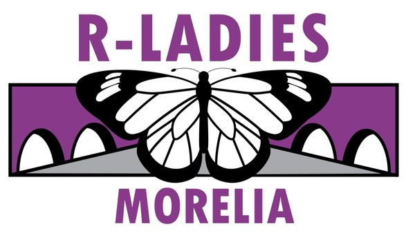

```{r setup, include = FALSE}
# Setup chunk
# Paquetes a usar
# options(htmltools.dir.version = FALSE)
library(knitr)
library(tidyverse)
library(xaringanExtra)
library(icons)
library(fontawesome) 
library(emo) 

# set default options de knitr
opts_chunk$set(collapse = TRUE, 
               dpi = 300,  # resolución de los gráficos
               warning = FALSE, # no mostrar mensajes de advertencia
               error = FALSE, # No mostrar mensajes de error en las diapositivas
               comment = "#") # comentarios

xaringanExtra::use_tile_view()
xaringanExtra::use_clipboard()

xaringanExtra::use_panelset()

# Para compartir e incrustar en otro sitio web
xaringanExtra::use_share_again()
xaringanExtra::style_share_again(
  share_buttons = c("twitter", "linkedin")
)

xaringanExtra::use_extra_styles(
  hover_code_line = TRUE,         #<<
  mute_unhighlighted_code = TRUE  #<<
)
```

```{r xaringan-editable, echo=FALSE}
# Para tener opciones de edición: el lapiz y goma
xaringanExtra::use_editable(expires = 1)
xaringanExtra::use_scribble()
```

```{r xaringan-themer, include=FALSE, warning=FALSE}
# Establecer colores para el tema
library(xaringanthemer)
style_mono_light(base_color = "#562457")
```

class: title-slide, middle, center
background-image: url(imagenes/rladies_logo.jpeg) 
background-position: 10% 50%
background-size: 15%


.center-column[
# `r rmarkdown::metadata$title`
### `r rmarkdown::metadata$subtitle`

####`r rmarkdown::metadata$author` 
#### `r rmarkdown::metadata$date`
]

.left[.footnote[RLdaies Theme[RLadies Theme](https://www.apreshill.com/project/rladies-xaringan/)]]

---
background-image: url(imagenes/rladies_logo.jpeg) 
background-position: 10% 10%
background-size: 10%
class: middle, center


# Alinear texto

.left[

### Texto a la izquierda


]

.center[

### Texto en el centro

]

.right[

###  Texto a la derecha

]

---

class: center, middle

<br>
## [R-Ladies Morelia](https://www.meetup.com/es-ES/rladies-morelia/)


---

class: center, middle

`r fontawesome::fa("laptop-file", height = "3em")`
# ¿Cómo creamos presentaciones con R?

--

----


### remark.js

--

### xaringan

--

### CSS

---

## Usar `pull-left` y `pull-right`

----

.pull-left[
.center[
### `r fontawesome::fa("js")`JavaScript

### **y**

### `r fontawesome::fa("markdown")` Markdown
]
]

.pull-right[
Una herramienta para presentaciones de diapositivas basadas en Markdown a traves de la web.

```{r, echo=FALSE}
knitr::include_url("https://remarkjs.com", height = "350px")
```
[https://remarkjs.com](https://remarkjs.com)
]

