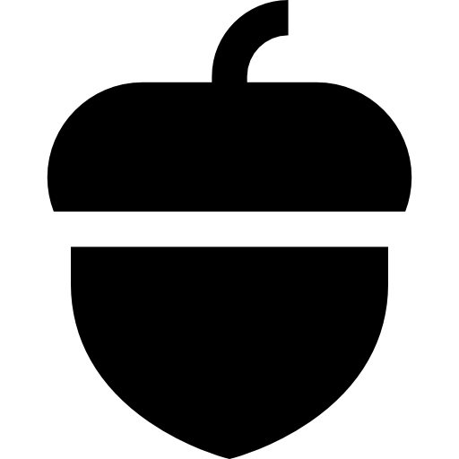
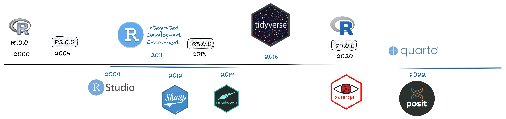
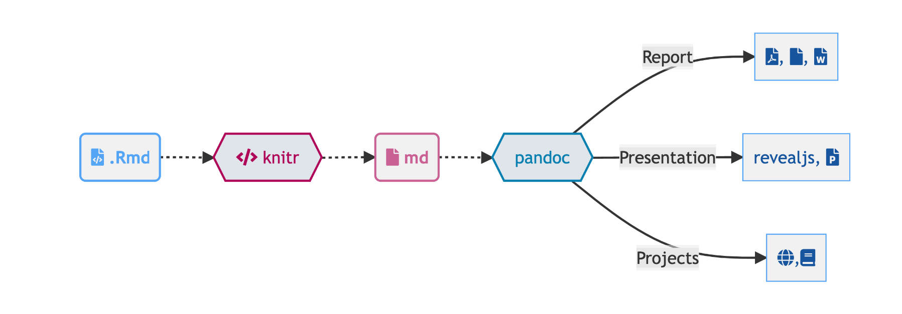
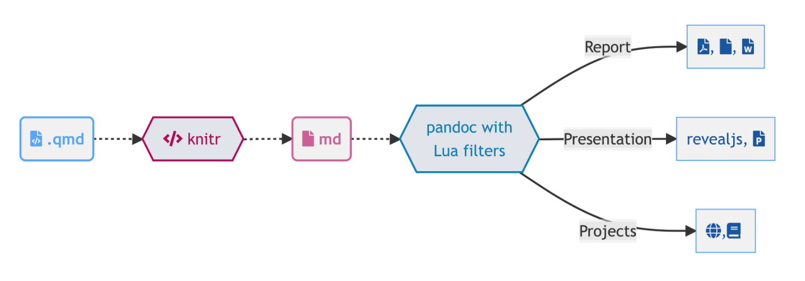
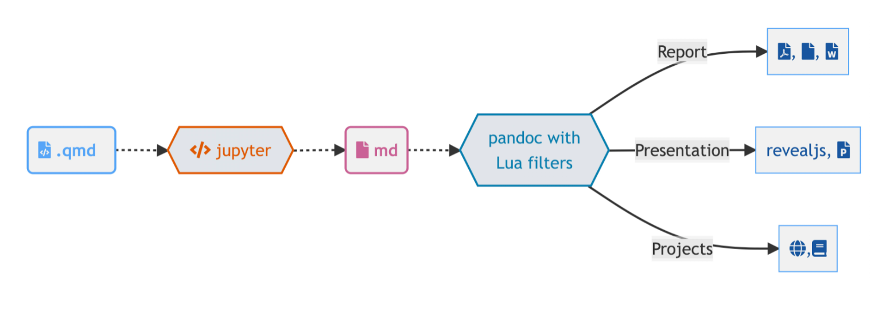
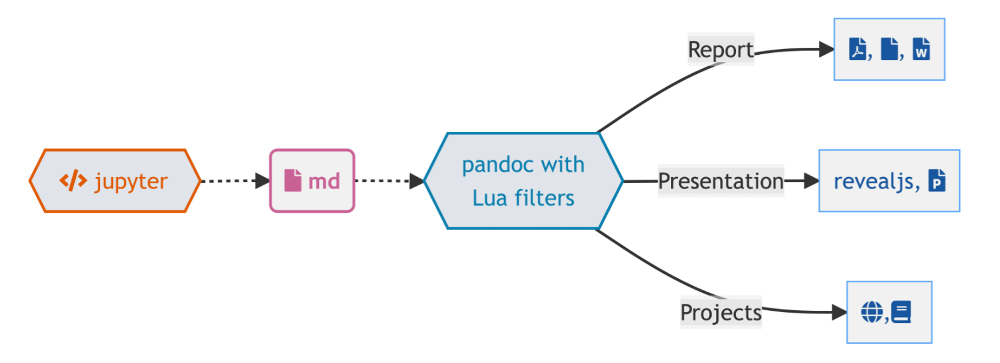

```{r setup, include = FALSE}
# Setup chunk
# Paquetes a usar
#options(htmltools.dir.version = FALSE) cambia la forma de incluir código, los colores

library(knitr)
library(tidyverse)
library(xaringanExtra)
library(icons)
library(fontawesome)
library(emo)

# set default options
opts_chunk$set(collapse = TRUE,
               dpi = 300,
               warning = FALSE,
               error = FALSE,
               comment = "#")

top_icon = function(x) {
  icons::icon_style(
    icons::fontawesome(x),
    position = "fixed", top = 10, right = 10
  )
}

knit_engines$set("yaml", "markdown")

# Con la tecla "O" permite ver todas las diapositivas
xaringanExtra::use_tile_view()
# Agrega el boton de copiar los códigos de los chunks
xaringanExtra::use_clipboard()

# Crea paneles impresionantes 
xaringanExtra::use_panelset()

# Para compartir e incrustar en otro sitio web
xaringanExtra::use_share_again()
xaringanExtra::style_share_again(
  share_buttons = c("twitter", "linkedin")
)

# Funcionalidades de los chunks, pone un triangulito junto a la línea que se señala
xaringanExtra::use_extra_styles(
  hover_code_line = TRUE,         #<<
  mute_unhighlighted_code = TRUE  #<<
)

# Agregar web cam

xaringanExtra::use_webcam()
```

```{r xaringan-editable, echo=FALSE}
# Para tener opciones para hacer editable algun chunk
xaringanExtra::use_editable(expires = 1)
# Para hacer que aparezca el lápiz y goma
xaringanExtra::use_scribble()
```

```{r xaringan-themer, include=FALSE, warning=FALSE}
# Establecer colores para el tema
library(xaringanthemer)
#style_mono_light(base_color = "#562457")
```

class: title-slide, middle, center
background-image: url(imagenes/rladies_logo.jpeg) 
background-position: 10% 50%
background-size: 15%


.center-column[
# `r rmarkdown::metadata$title`
### `r rmarkdown::metadata$subtitle`

####`r rmarkdown::metadata$author` 
#### `r rmarkdown::metadata$date`
]

.left[.footnote[R-Ladies Theme[R-Ladies Theme](https://www.apreshill.com/project/rladies-xaringan/)]]

---
background-image: url(imagenes/rladies_logo.jpeg) 
background-position: 10% 10%
background-size: 10%
class: middle, center


# Sobre nosotras
----

.left-col[

###  Sofía

Estudiante de maestría en Ciencias Biológicas

Áreas: Genética de poblaciones, Filogeografía, Ecología 

[`r fontawesome::fa("link")` sofiazorrilla](https://github.com/sofiazorrilla)

]

.center-col[

### `r fontawesome::fa("dna", fill = "#181818")` Fernanda Cidel

Estudiante de Lic. en Ecología 
ENES Morelia, UNAM

Lab. Genética de la Conservación 

]

.right-col[

### `r fontawesome::fa("circle-nodes", fill = "#181818")` Haydeé

Investigadora Posdoctoral en el CCM UNAM

Áreas: Análisis Topológico de Datos, Teoría Geométrica de Grupos

[`r fontawesome::fa("link")` haydeeperuyero.github.io](https://haydeeperuyero.github.io/)

]

---

class: center, middle

<br>
## ¿Qué vamos a ver?

----

--

#### [`r emo::ji("package")` RLadies](https://www.apreshill.com/project/rladies-xaringan/): Usaremos el [tema de R-Ladies](https://www.apreshill.com/project/rladies-xaringan/)

--


#### [`r emo::ji("package")` xaringan ](https://github.com/yihui/xaringan#xaringan): Paquete para crear diapositivas con `remarks.js` y R Markdown 

--

#### [`r emo::ji("package")` xaringanExtra](https://github.com/gadenbuie/xaringanExtra/#xaringanExtra): Opciones de edición en línea, incrustar en otro documento, escribir y otras características `r emo::ji("sunglasses")`

--


####  [Quarto revealjs](https://quarto.org/docs/presentations/revealjs/): Nuevo sistema de publicación de documentos que integra  R y otros lenguajes de programación (python, Julia, etc.)

---


class: center, middle

`r fontawesome::fa("laptop-file", height = "3em")`
# ¿Cómo creamos presentaciones con Rmd?

--

----


### remark.js

--

### xaringan

--

### CSS

---

.pull-left[ .center[

## remark.js

### `r fontawesome::fa("js")`JavaScript

### **y**

### `r fontawesome::fa("markdown")` Markdown


Una herramienta para presentaciones de diapositivas basadas en Markdown a través de la web.

```{r, echo=FALSE}
knitr::include_url("https://remarkjs.com", height = "150px")
```
[https://remarkjs.com](https://remarkjs.com)

]

]

.pull-right[.center[

##  xaringan


Paquete que le presenta `remark.js` a R Markdown


El autor menciona que una presentación debe comunicar .my-red[conocimiento] y una gran presentación debe .my-red[hipnotizar] a la audiencia. 

```{r, echo=FALSE}
knitr::include_url("https://slides.yihui.org/xaringan", height = "150px")
```
[https://slides.yihui.org/xaringan](https://slides.yihui.org/xaringan)

]

]

---

## CSS

----

**CSS** significa **C**ascading **S**tyle **S**heet y es una hoja de estilo que convierte:
.pull-left[
Contenido HTML funcional pero .my-red["plano"]


]

.pull-right[
en contenido HTML con .my-red["formato".]


]

---
background-color: var(--quarto)
class: center, middle

# Otra opción: Quarto 

---
background-color: var(--quarto)

# Historia 

<br>



---
background-color: var(--quarto)

# Quarto reveal js

.pull-left[
- Quarto es un sistema open-source de publicaciones científicas y técnicas construido a partir de Pandoc.

**Ventajas**
  - No depende de un lenguaje de programación en particular 
  - Interfaz de línea de comandos
  - Muchas funciones ya vienen listas para usarse 
{{content}}
]

--

**Rmarkdown**


--
.right-up[
**Quarto**

{{content}}
]

--

{{content}}

--


---
### Paquetes necesarios

  - Xaringan: 
```{r, eval = FALSE}
remotes::install_github('yihui/xaringan')
```

  - XaringanExtra
```{r, eval=FALSE}
# Opción 1
install.packages("xaringanExtra")
# Opción 2
# install.packages("remotes")
remotes::install_github("gadenbuie/xaringanExtra")
```

  - Quarto: Preinstalado con RStudio >= v2023.03
  
  - Icons:
  
```{r, eval=FALSE}
remotes::install_github("mitchelloharawild/icons")
devtools::install_github("hadley/emo")
#install.packages("fontawesome")
#download_fontawesome()
```

---

class: middle, center

`r fontawesome::fa("file-circle-question", height = "3em")`
# ¿Cómo creamos una presentacion?

----

## **Opción 1:** Crear una presentación desde cero.

--

## **Opción 2:** Usar alguna plantilla 

### `r fontawesome::fa("github")` [tutorial/ejemplo-diapositivas-xaringan.Rmd](https://github.com/HaydeePeruyero/Xaringan_RLadies/tutorial/ejemplo-diapositivas-xaringan.Rmd)

---

## `r fontawesome::fa("file-powerpoint")` Crear una presentación desde cero

.pull-left[
### 1\. `r emo::ji("page_facing_up")` New File

### 2\. `r emo::ji("page_facing_up")` New R Markdown


]

--

.pull-right[
### 3\. `r emo::ji("memo")` From Template `r fontawesome::fa("angle-right")` Ninja Presentation


### 4\. `r emo::ji("floppy_disk")` Editar y guardar documento
]


---

background-color: var(--quarto)

# Quarto revealjs

.pull-left[
#### 1\. `r emo::ji("page_facing_up")` New File

#### 2\. `r emo::ji("page_facing_up")` New R Quarto Document

  
]

.pull-right[
<br>
<br>

  

]

---
background-color: var(--Purple)
class: middle, center, inverse

`r fontawesome::fa("code", height = "3em")`
# Práctica: 
## Crea tus primeras diapositivas

---

### `r fontawesome::fa("file")` Usar la plantilla de R-Ladies Morelia

#### YAML

```{yaml, eval=FALSE, echo=TRUE}
title: "Título"
subtitle: "Subtítulo"
author: "Nombre autor"
institute: "R-Ladies Morelia"
date: "2023/05/17"
output:
  xaringan::moon_reader:     # Tipo de salida
    css: [xaringan-themer.css, css/mytheme.css, rladies, rladies-fonts ] # Los temas a usar CSS 
    lib_dir: libs           # Crea un directorio para las bibliotecas
    seal: false             # Permite crear diapositiva de título personalizada 
    self_contained: false   
    nature:
      highlightStyle: github   # Resaltar la sintaxis de los bloques de código con estilo github 
      highlightLines: true    # Permite resaltar líneas de código
      countIncrementalSlides: false  # No incrementa el número de diapositiva para diapositivas graduales
      ratio: 16:9               # Proporción de diapositiva: 4:3
      beforeInit: "archivo.js"  # Agregar los macros, el de columnas
      slideNumberFormat: |          # formato de número de página 
```

---

background-color: var(--quarto)

# Quarto revealjs: YAML

```{r, echo=FALSE}
xaringanExtra::embed_xaringan("Quarto_ejemplos/crear_diapositivas.html", max_width = 900)
```

---

### `r fontawesome::fa("file")` Usar la plantilla de R-Ladies Morelia

#### El bloque de configuración ("Setup")

```{r setup1, include = TRUE, echo= TRUE, eval=FALSE}
# Setup chunk
# Paquetes a usar
#options(htmltools.dir.version = FALSE)
library(knitr)
library(tidyverse)
library(xaringanExtra)
library(icons)
library(fontawesome) 
library(emo) 
library(gt)

# set default options de knitr
opts_chunk$set(collapse = TRUE, 
               dpi = 300,  # resolución de los gráficos
               warning = FALSE, # no mostrar mensajes de advertencia
               error = FALSE, # No mostrar mensajes de error en las diapositivas
               comment = "#") # comentarios
```

El contenido de la primera diapositiva comienza debajo de los tres guiones `---` después del `YAML`.

---

# Configuración de los Chunks

En los chunks algunas cosas que se pueden especificar son: `{r setup1, include = FALSE, echo= FALSE, eval=FALSE}`:

  - `include = FALSE`: no muestra el código. 
  - `echo = FALSE`: no muestra el resultado en el documento final.
  - `warning = FALSE`: no muestra los warnings.
  - `error = FALSE`: no muestra los mensajes de error.
  - `message = FALSE`: no muestra los mensajes.
  - `collapse = TRUE`: de ser posible colapsa la fuente y outputs de los bloques de código.
  - `eval = FALSE`: no evalúa los códigos, sirve para mostrar bloques de código sin que emita resultados.
  - `fig.dim = c(n,m)`: vector numérico para el tamaño de los plots.
  - `fig.cap:"message"`:para colocar un caption a los plots.
  - `highlight.output=c(n, m)`: resaltar líneas n,m del código.

Otras opciones para los chunks están [aquí](https://yihui.org/knitr/options/#chunk-options).

---

background-color: var(--quarto)

# Quarto revealjs: opciones de chunks

```{r, echo=FALSE}
xaringanExtra::embed_xaringan("Quarto_ejemplos/chunks.html", max_width = 900)
```

---

# `r fontawesome::fa("rocket")` Moon Reader

`r emo::ji("yarn")` Para generar las diapositivas tenemos que usar la opción de knit `Moon Reader` o desde la consola 
.left[
```{r, include = TRUE, eval=FALSE}
xaringan::inf_mr()
```
]

---

background-color: var(--Purple)
class: middle, center, inverse

`r fontawesome::fa("code", height = "3em")`
# Práctica: 
## Genera tus diapositivas

---

# Sintaxis de Xaringan

Xaringan ocupa tanto código RMarkdown como código de `remarks.js` y `css`.

.pull-left[

### RMarkdown:

  - Títulos: 
    - `# Título principal`
    - `## Subtítulo`
    - `### Título de 3er nivel`
  - Cursiva: *italic* o _italic_
  - Negrita: **bold** o __bold__
  - Superscript: ^2
  - Tachado: ~~tachado~~
  - Listas: con `*` o `-` y numéricas con `1`
    - `* item 1`
    - `* item 2`
  - Links: `[link](dirección)`
  - Imágenes: ``
  
]

.pull-right[

## `remark.js`

  - La primera diapositiva comienza después del `YAML` y los `---`
  - Cada diapositiva va después de tres `---`.
  - Diapositivas graduales con `--`
  - Separar encabezado de texto con `----`
  - Notas de orador con `???`

]

---
background-color: var(--quarto)

# Quarto revealjs: Sintaxis

```{r, echo=FALSE}
xaringanExtra::embed_xaringan("Quarto_ejemplos/sintaxis.html", max_width = 900)
```

---

# Diapositiva de título

En el `YAML` inicial, se configuró la opción `seal = FALSE` lo cual nos permite configurar nuestra diapositiva de título, si se quita esta opción, entonces la diapositiva de título será la de default del tema.

```{r, eval=FALSE}
class: title-slide, middle, center
background-image: url(imagenes/rladies_logo.jpeg) 
background-position: 10% 50%
background-size: 15%


.center-column[
# `r rmarkdown::metadata$title`
### `r rmarkdown::metadata$subtitle`

####`r rmarkdown::metadata$author` 
#### `r rmarkdown::metadata$date`

]

.left[.footnote[[RLadies Theme](https://www.apreshill.com/project/rladies-xaringan/)]]
```


---
background-color: var(--quarto)

## Quarto revealjs: diapositiva de título


- Para omitir la diapositiva de título, no se agrega la opción `title` en el YAML y se puede configurar como cualquier diapositiva.
- Para configurar desde el YAML: 

.pull-left[
```{r eval=FALSE}
---
title: "Titulo de la presentación"
subtitle: "Subtítulo"
title-slide-attributes:
  data-background-image: GOPR0710.JPG
  data-background-size: contain
  data-background-opacity: "0.85"
  
format: 
    revealjs:
        theme: [default, ../custom.scss]
---
```
]

.pull-right[
```{r, echo=FALSE}
xaringanExtra::embed_xaringan("Quarto_ejemplos/diapo_titulo.html", max_width = 500)
```

]

---

background-color: var(--Purple)
class: middle, center, inverse

`r fontawesome::fa("code", height = "3em")`
# Práctica: 
## Crea tu diapositiva de título y algunas diapositivas

---
class: middle, center
background-color: var(--my-pink)
# `r fontawesome::fa("table-columns")` Ubicación de texto
----

Para definir la **alineación** de los elementos de la diapositiva tenemos varias opciones:

--

`r fontawesome::fa("1")`

### Alinear diapositiva entera
```{{r}}
#class: middle, center

#left,izquierda ; center,centro ; right,derecha

#top,arriba ; middle,medio ; bottom,abajo
```
--
Donde **middle** define la posición vertical y **center** la posición horizontal

---
class: middle, center
# Ubicación de texto 

`r fontawesome::fa("2")`

### Alinear solo parte del texto
----

.left[
Insertamos una parte del texto a la izquierda
]
.center[...

]
--
.right[
Pero para usar toda la diapositiva, completamos a la derecha
]

--

```{r}
#.left[Inserta aquí] Añade texto a la **izquierda**
#.center[Inserta aquí] Añade texto al **centro**
#.right[Inserta aquí] Añade texto a la **derecha**
```
----

--
.center[También podemos agregar texto en el centro, 
aunque para esta opción podemos usar solo una de las alineaciones]

---
background-color: var(--Purple)
class: middle, center

# Ubicación de texto 

`r fontawesome::fa("3")`

### `r fontawesome::fa("table-columns")` Columnas con `pull-left` y `pull-right`
--

Generamos clases para organizar por columnas, donde: 

--

.pull-left[
```{r eval=FALSE}
#.pull-left[Insertas tu texto]
```

* Abarca el 47% izquierdo de la diapositiva

{{content}}
]

--
* Puede contener imágenes


--

.pull-right[
* No es obligatorio ser complementado a la derecha

--
```{r}
#.pull-right[Insertas tu texto]
```

* Abarca el otro 47%
]

--

----
.center[.morado-claro[Puede incluir otras alineaciones y no se empalma `r emo::ji("smile")`]
]

---
class: middle, center

# Ubicación de texto 

`r fontawesome::fa("4")`

### `r fontawesome::fa("table-columns")` Columnas con `left-column` y `right-column`

----

--
Divide el texto de la diapositiva en dos columnas

--
.left-column[

```{r eval=FALSE}
#.left-column[] coloca  una columna a la _izquierda_
```

* Tiene un 20% de ancho de la diapositiva

* **Y el texto es un poco más claro**
]

--

.right-column[
```{r eval=FALSE}
#.right-column[]` _columna-derecha_ coloca la columna derecha
```

- Tiene un 75% de ancho de la diapositiva
{{content}}
]
--

- Estan fijas para la diapositiva entera
--

.no-col-center-bottom[

----

<<<<<<< HEAD
.center[**Estas clases de columnas estan diseñadas para usarse juntas**
]
=======
Estas clases de columnas estan diseñadas para usarse juntas
>>>>>>> origin

]

---
class: middle, center
# Ubicación de texto

## `r fontawesome::fa("table-columns")` Columnas con clase `css`


---

background-color: var(--quarto)

# Quarto revealjs: alineación

```{r, echo=FALSE}
xaringanExtra::embed_xaringan("Quarto_ejemplos/alineacion.html", max_width = 900)
```

---

background-color: var(--Purple)
class: middle, center, inverse

`r fontawesome::fa("code", height = "3em")`
# Práctica: 
## Crea diapositivas alineando texto

---

# Imágenes

Existen tres formas de poner imágenes en una diapositiva.

## Primera opción: Markdown

.pull-left[

```{markdown, eval=FALSE, echo=TRUE}

```


  - Es la forma estándar de poner imágenes en Markdown.
  - No es muy flexible `r emo::ji("sad")` .
  - El tamaño de salida de la imagen depende de la imagen. 
  - Se puede cambiar el tamaño de la imagen con  [macros personalizados](https://slides.yihui.org/xaringan/#33) o con las opciones `{width='500px'}` `r emo::ji("smirking_face")`

]
.pull-right[


]

---

# Imágenes

## Segunda opción: Knit

.pull-left[


```{r imagen-knitr_example, echo=TRUE, fig.show="hide"}
knitr::include_graphics("imagenes/rladies_logo.jpeg")
```


  - Bastante flexible `r emo::ji("happy")` .
  - El bloque de código toma espacio.
  - Permite incluir texto alternativo.
  - Se puede configurar dimensión, posición con los atributos del chunk `r emo::ji("smirking_face")`.
  
]
.pull-right[

```{r imagen-knitr, fig.dim=c(3,2), fig.cap="Logo de R-Ladies Morelia", fig.alt="Logo de R-Ladies Morelia"}
knitr::include_graphics("imagenes/rladies_logo.jpeg")
```


]

---

# Imágenes

## Tercera opción: HTML

.pull-left[
```{html, eval=FALSE, echo=TRUE}

```

  - Es la opción más flexible.
  - No tiene apariencia agradable su código
  - Referencia de la [sintaxis](https://www.w3schools.com/html/html_images.asp)


]

.pull-right[

]
---
class: middle, center

## `r fontawesome::fa("image")` Imagenes

También hay varias formas de seleccionar una imagen de fondo.

----

  - `url(https://enlaceweb.aqui)` --> imagen del web
  - `url(img/jacarandas.jpg)` --> imagen local, usando rutas de archivos relativas
  
---

class: middle, center

# **"background-image"**
**sin indicar tamaño**

```{r eval= FALSE}
background-image: url("imagenes/rladies_logo.jpeg")
```

----

.right[.morado-claro[ejemplo de `background-image` `r fontawesome::fa("arrow-circle-right")` ]]

---
background-image: url("imagenes/rladies_logo.jpeg")
class: middle, center, inverse


---
class: middle, center

## `r fontawesome::fa("image")` Imagenes

**Opciones:**

--

- `background-size:` (_tamaño de la imagen del fondo_)

--
- `cover` --> (_cubrir_) cambia la escala y recorta sin que quede espacio en blanco

--
- `contain` --> (_contener_) cambia la escala solamente

--

----
.right[.morado-claro[ejemplo de `background-size` `r fontawesome::fa("arrow-circle-right")` ]]   

---
background-image: url("imagenes/rladies_logo.jpeg")
background-size: cover
class: inverse


---
background-image: url("imagenes/rladies_logo_v.jpeg")
background-size: contain
class: inverse


---
class: middle, center

## `r fontawesome::fa("image")` Imagenes

- `background-position:`  (_posición de la imagen del fondo_) [experimenta con esta propiedad](https://css-tricks.com/almanac/properties/b/background-position/)

----
.right[.morado-claro[ejemplo de `background-size` `r fontawesome::fa("arrow-circle-right")` ]]

---
background-image: url("imagenes/rladies_logo.jpeg")
background-position: left
class: inverse


---
background-image: url("imagenes/rladies_logo.jpeg")
background-position: right
class: inverse

---
class: inverse, middle, center

# Elementos de `r fontawesome::fa("r-project", fill = "steelblue")`

---

## `r fontawesome::fa("table")` Tablas

.panelset[
.panel[.panel-name[Output estándar]

```{r}
data(iris)
head(iris)
```
]

.panel[.panel-name[Kable (HTML)]

```{r}
iris %>%
  head() %>%
  knitr::kable(format = "html")
```
]

.panel[.panel-name[DataTable]

```{r, echo=TRUE}
iris %>%
  head(3)%>%
  DT::datatable()
```
]
]

---

### [`library(gt)`](https://gt.rstudio.com/index.html)

```{r, echo=TRUE, eval=TRUE}
iris %>% 
  head() %>%
  gt::gt() %>%
  gt::tab_spanner(label = "Petalo", columns = vars(Petal.Length,Petal.Width)) %>%
  gt::tab_spanner(label = "Sepalo", columns = vars(Sepal.Length,Sepal.Width))
```

---

background-color: var(--Purple)
class: middle, center, inverse

`r fontawesome::fa("code", height = "3em")`
# Práctica: 
### Carga tu base de datos favorita y muestrala en tus diapositivas

---

## `r fontawesome::fa("chart-line")` Plots

.pull-left[

#### Código

````
```{r plot, echo=TRUE, fig.height=5, fig.show='hide'}`r ''`
cl <- c("maroon3", "sienna2", "skyblue1")

p <- ggplot(iris, aes(x=Sepal.Length, y=Sepal.Width))+
  geom_point(aes(colour = Species)) +
  scale_colour_manual(values=cl)+
  labs(title = "Longitud y Ancho Sepal",
       subtitle = "Iris data set",
       x = "Longitud Sepal",
       y = "Ancho Sepal",
       caption = "Datos: Iris data set from `data(iris)`",
       fill = "Especies")
p
```
````

]

.pull-right[

#### Plot```{r plot2, echo=FALSE, fig.height=5}
cl <- c("maroon3", "sienna2", "skyblue1")

p <- ggplot(iris, aes(x=Sepal.Length, y=Sepal.Width))+
  geom_point(aes(colour = Species)) +
  scale_colour_manual(values=cl)+
  labs(title = "Longitud y Ancho Sepal",
       subtitle = "Iris data set",
       x = "Longitud Sepal",
       y = "Ancho Sepal",
       caption = "Datos: Iris data set from `data(iris)`",
       fill = "Especies")
p
```

]

---

background-color: var(--Purple)
class: middle, center, inverse

`r fontawesome::fa("code", height = "3em")`
# Práctica: 
### Con la base de datos que cargaste, genera un plot con diferentes opciones del chunk

---

## `r fontawesome::fa("code")` Códigos

La forma de incrustar código en tus presentaciones es con los chunks. Existen varias formas de resaltar código.

.panelset[
.panel[.panel-name[`*`]

````
```{r tidy=FALSE, eval =FALSE}`r ''`
x <- 1
y <- 2
** z <- x+y
```
````

Produciría

```r
x <- 1
y <- 2
* z <- x+y 
```

]

.panel[.panel-name[`{{ code }}`]

````
```{r tidy=FALSE, eval=FALSE}`r ''`
x <- 1
y <- 2
{{ z <- x+y }}
```
````

Produciría

```{r tidy=FALSE}
x <- 1
y <- 2
{{ z <- x+y }}
```


]

.panel[.panel-name[`#<<`]

````
```{r tidy=FALSE, eval=FALSE}`r ''`
x <- 1
y <- 2
z <- x+y #<<
```
````

Produciría

```{r tidy=FALSE}
x <- 1
y <- 2
z <- x+y #<<
```


]
]

Las opciones de los chunks en los 3 casos son solo para ejemplo, recordar que `eval=FALSE` realizará que no se evalúe el código.

---
background-color: var(--quarto)

## Quarto revealjs: resaltar código

```{r, echo=FALSE}
xaringanExtra::embed_xaringan("Quarto_ejemplos/codigo_resaltado.html", max_width = 900)
```

---

background-color: var(--Purple)
class: middle, center, inverse

`r fontawesome::fa("code", height = "3em")`
# Práctica: 
## Incrusta código y resalta algunas líneas

---

# ¿Cómo compartir nuestras diapositivas?

----

### **Primera opción:** 

Con "self_contained: TRUE" en el YAML para `r fontawesome::fa("paper-plane")`

--

### **Segunda opción:** 

Alojando tus archivos en un repositorio para `r fontawesome::fa("link")`

---

#### Pasos para compartir tus diapositivas:

1\. Agrega la opción `self_contained: TRUE` en tu YAML.

2\. En tu repositorio de github, activa la opción de github pages.


3\. Copia el link de la página. Si tu repositorio y archivo `html` estaba en el link

https://github.com/user/nombre_repositorio/blob/main/archivo_xaringan.html

El link a compartir será: https://user.github.io/nombre_repositorio/archivo_xaringan.html


---

### **Tercera opción:**

--

 Con el paquete `XaringanExtra` las puedes incrustar en otros documentos como las que has visto en estas diapositivas. Para esto, debes agregar en tu `setup` lo siguiente:
 
```{r, eval=FALSE}
xaringanExtra::use_share_again()
xaringanExtra::style_share_again(
  share_buttons = c("twitter", "linkedin")
)
```
 
-- 

Y después en tus documentos:

```{r, eval=FALSE}
xaringanExtra::embed_xaringan(url = "https://haydeeperuyero.github.io/Xaringan_RLadies/xaringan.html", ratio = "16:9", max_width = 600)
```

O la opción:

```{r, eval=FALSE}
knitr::include_url("https://haydeeperuyero.github.io/Xaringan_RLadies/xaringan.html", height = "150px")
```

---

## Ejemplo:

```{r, echo=FALSE}
xaringanExtra::embed_xaringan(url = "https://haydeeperuyero.github.io/Xaringan_RLadies/xaringan.html", ratio = "16:9", max_width = 600)
```

---

# LaTeX

Xaringan soporta incluir código Latex para texto matemático en la forma usual. Las expresiones matemáticas se encierran entre `$`, solo se debe tener cuidado de que no queden junto a texto normal porque de lo contrario se procesará bien. Por ejemplo: 

`$S = \frac{1}{n-1} \sum_{i=1}^{n} (x_{i} - \bar{x}) (x_{i}-\bar{x}) ^{T}$` producirá: 

$S = \frac{1}{n-1} \sum_{i=1}^{n} (x_{i} - \bar{x}) (x_{i}-\bar{x}) ^{T}$


Para incluir ecuaciones centradas, la forma de hacerlo es encerrarlas entre doble `$$`. Por ejemplo:

.pull-left[
`$$\left( \begin{matrix}`
`\sigma_1^2 & \sigma_{12} & \cdots & \sigma_{1n} \\`
`\sigma_{21} & \sigma_2^2 & \cdots & \sigma_{2n} \\`
`\vdots & \vdots & \ddots & \vdots \\`
`\sigma_{n1} & \sigma_{n2} & \cdots & \sigma_{n}^2 `
`\end{matrix} \right)$$` producirá:
]

.pull-right[
$$\left( \begin{matrix}
\sigma_1^2 & \sigma_{12} & \cdots & \sigma_{1n} \\
\sigma_{21} & \sigma_2^2 & \cdots & \sigma_{2n} \\
\vdots & \vdots & \ddots & \vdots \\
\sigma_{n1} & \sigma_{n2} & \cdots & \sigma_{n}^2 
\end{matrix} \right)$$
]


---

### XaringanExtra

--

#### Vista previa

Con la tecla "O" permite ver todas las diapositivas.

```{r, eval=FALSE}
xaringanExtra::use_tile_view()
```

--

#### WebCam

Preciona `W` y `shift + W` `r emo::ji("smirking_face")`.

```{r, eval=FALSE}
xaringanExtra::use_webcam()
```

--

#### Copiar chunks

Agrega el boton de copiar los códigos de los chunks.

```{r, eval=FALSE}
xaringanExtra::use_clipboard()
```


---

#### Paneles

Crea paneles impresionantes como los usados en el apartado de tablas.

```{r, eval=FALSE}
xaringanExtra::use_panelset()
```

--

#### Funcionalidades de los chunks

Funcionalidades de los chunks, pone un triangulito junto a la línea que se señala.

```{r, eval=FALSE}
xaringanExtra::use_extra_styles(
  hover_code_line = TRUE,         #<<
  mute_unhighlighted_code = TRUE  #<<
)
```

---

#### Diapositivas editables 

Para hacer que aparezca el lápiz y goma.

```{r, eval=FALSE}
xaringanExtra::use_scribble()
```

--

Para tener opciones para hacer editable algún chunk.

```{r, eval=FALSE}
xaringanExtra::use_editable(expires = 1)
```

Por ejemplo `r emo::ji("smirking_face")`:

.pull-left[

```r
---
.can-edit.key-likes[
- Item 1
- Item 2
]
---
```
]

.pull-right[

.can-edit.key-likes[
- Item 1
- Item 2
]
]

---
background-color: var(--quarto)

## Quarto revealjs: Navegación 

```{r, echo=FALSE}
xaringanExtra::embed_xaringan("Quarto_ejemplos/navegacion.html", max_width = 900)
```

---

# `r fontawesome::fa("book")` Referencias
.pull-left[
- [Presentación Rladies Xalapa Xaringan](https://slides.silviacanelon.com/introduccion-xaringan)
  - [Video presentación R Ladies Xalapa sobre Xaringan](https://www.youtube.com/watch?v=uBXEtM-OHlI&ab_channel=R-LadiesXalapa)
- [Curso de Xaringan avanzado](https://spcanelon.github.io/xaringan-basics-and-beyond/)
- [Curso CSS freecodecamp](https://www.youtube.com/watch?v=OXGznpKZ_sA&ab_channel=freeCodeCamp.org)
  - [Repositorio de recursos del curso (CSS)](https://github.com/gitdagray/css_course)
- [Xaringan](https://bookdown.org/yihui/rmarkdown/xaringan.html)
- [Rmarkdown con Latex](https://github.com/HaydeePeruyero/Rmarkdown_and_LaTeX)
- [Presentaciones revealjs](https://quarto.org/docs/presentations/revealjs/)
]

.pull-right[
- [Tema de RLadies Global](https://www.apreshill.com/project/rladies-xaringan/)
- [Xaringan Extra](https://github.com/gadenbuie/xaringanExtra)
- [Icons](https://github.com/mitchelloharawild/icons)
- [Ejemplo de Sydney-Xaringan](https://github.com/garthtarr/sydney_xaringan/tree/master)
- [`fontawesome`](https://fontawesome.com/)
- [Guia de Quarto revealjs](https://quarto.org/docs/presentations/revealjs/)
]